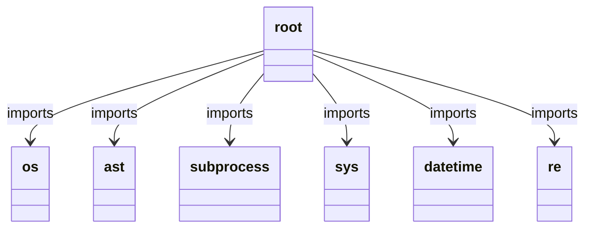
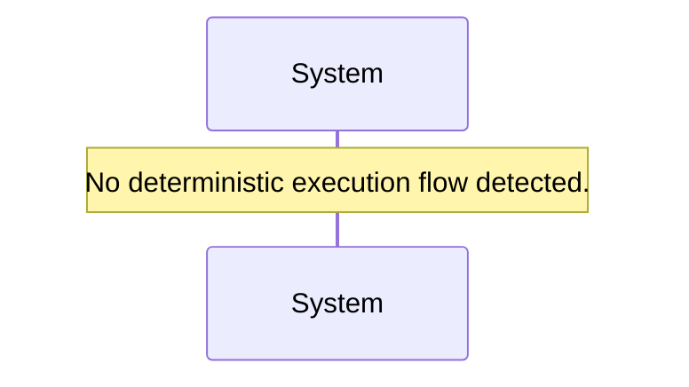

# Module Name: root

* **Source Directory Reference:** `./`
* **Package Dependency:** [List upstream and downstream package boundaries]

## 1. Executive Summary & Purpose
Deterministic architectural mapping of root.

## 2. UML 2.0 Class & Inheritance Architecture (Deterministic)
The following class diagram models the object-oriented structure, explicit inheritance hierarchies, and polymorphic interface implementations derived from local AST analysis:

```mermaid
classDiagram
```

## 3. Package & Class Relations

* **Inheritance & Polymorphism:** Detailed breakdown of abstract base classes, interfaces, and concrete overrides.
* **Dependencies:** How classes within this package collaborate externally.



## 4. Execution Flow & Runtime Behavior

The following sequence diagram outlines the execution lifecycle and message passing during core operations:



---

* **Source Citations:** No classes or methods detected.
